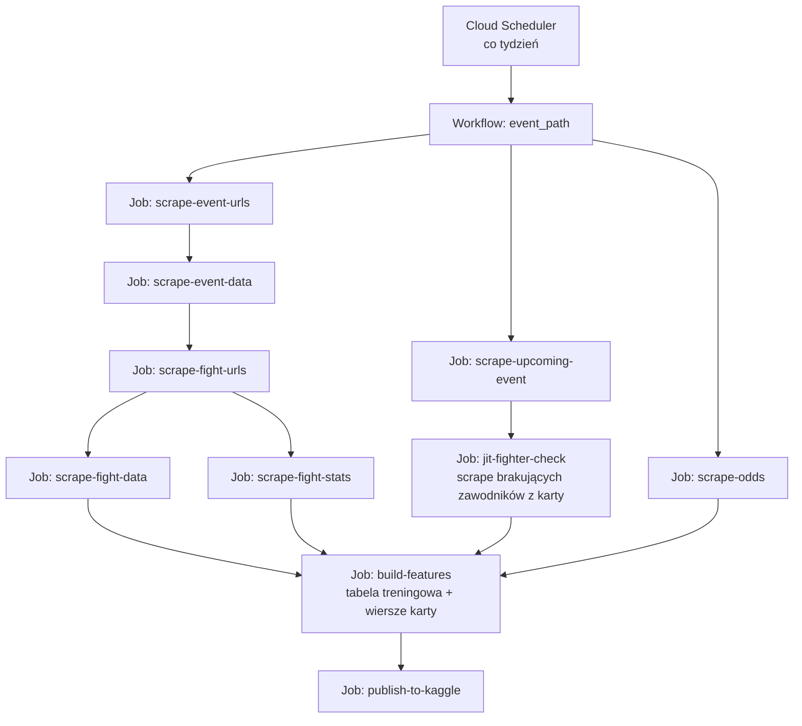
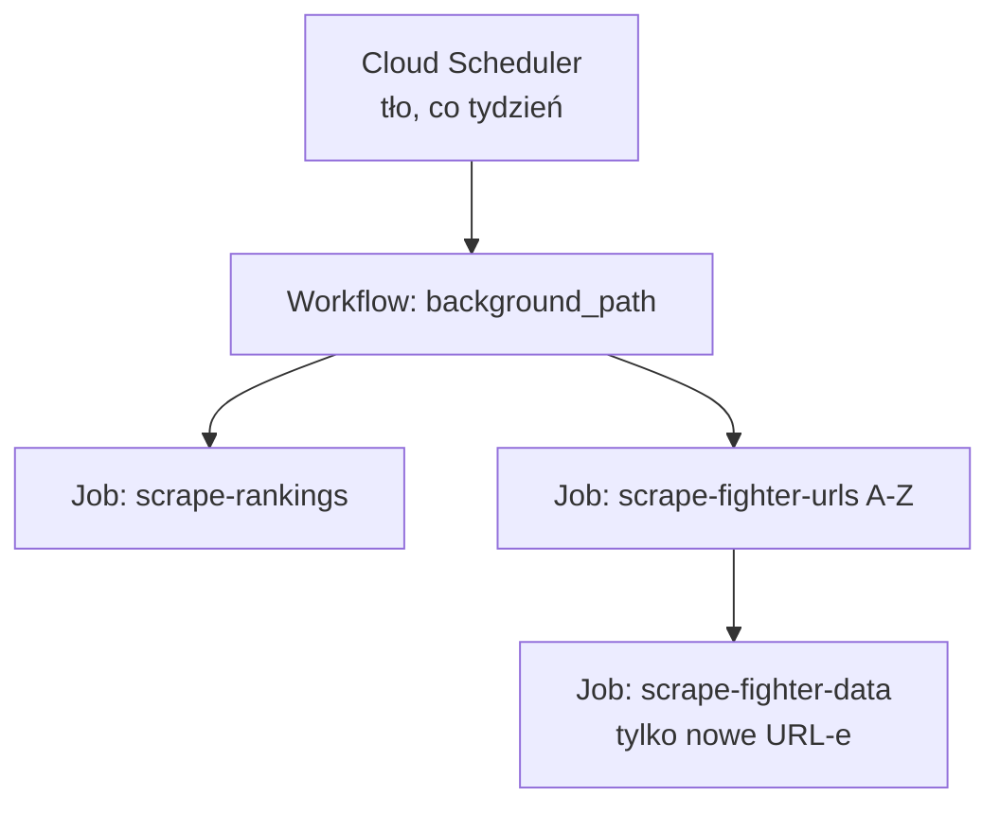

# ARCHITECTURE.md — UFC Pipeline (design-of-record)

> **Status:** plan / design-of-record. Implementacja: w Cursorze, zadanie po zadaniu (backlog → §13).
> **Zakres dokumentu:** ingest + warstwa danych + pipeline cech + orkiestracja.
> **Model i agenci są poza zakresem tej fazy** — patrz §11 (zostawiamy na nie szwy).

---

## 1. Cel i zakres

System pobiera dane o galach, walkach, zawodnikach, rankingach i kursach UFC, czyści je i łączy w BigQuery, a następnie produkuje **jeden** zestaw cech — używany zarówno do treningu modelu (offline, później), jak i do scoringu nadchodzącej karty. Dane są dodatkowo publikowane jako dataset na Kaggle.

**Cele:**
- Niezawodny, idempotentny, samonaprawialny pipeline — koniec kaskadowych awarii i ręcznego restartowania.
- **Train == serve by construction**: cechy treningowe i predykcyjne pochodzą z jednego modułu, nie z dwóch rozjechanych.
- Czysty, publikowalny dataset (Kaggle) + repo czytelne dla rekrutera.

**Poza zakresem teraz:** trenowanie modelu, agenci LLM. Architektura zostawia na nie wyraźne szwy (§11).

---

## 2. Zasady projektowe

- **Idempotencja.** Każdy krok można odpalić ponownie bez dublowania danych (`dedup not-in` / `WRITE_TRUNCATE` / `MERGE`). To warunek bezpiecznego restartu.
- **Rozdział warstw.** (a) ingest surowych → tabele landingowe; (b) transformacje → widoki BigQuery; (c) materializacja cech → tabela. Surowe tabele nigdy nie są nadpisywane logiką transformacji.
- **Dwie kadencje.** Ścieżka galowa (zależna od gali) i ścieżka tła (zawodnicy, rankingi) — niezależne (§5).
- **Jeden moduł cech.** Parametryzowany trybem `historical` vs `upcoming`; identyczny kod (§8).
- **Sekrety poza kodem.** Secret Manager / zmienne środowiskowe; w repo wyłącznie placeholdery (§9).
- **Kurs zamknięcia poza `X` modelu wyniku.** Kontrakt anty-leakage (§8).

---

## 3. Architektura orkiestracji

Trzy rozdzielone role (zamiast „Cloud Function + własny cron" × 10):

| Rola | Usługa | Co robi |
|---|---|---|
| Praca | **Cloud Run Jobs** | Scrapery i materializacja cech jako kontenery run-to-completion. Bez serwera HTTP, dłuższe timeouty, wbudowane retry. |
| Koordynacja | **Cloud Workflows** | Orkiestrator DAG (YAML). Wywołuje Joby (konektor Cloud Run), **czeka na zakończenie**, rozgałęzia, retry z backoffem. |
| Wyzwalacz | **Cloud Scheduler** | Cron. Odpala *wykonanie workflowu* (nie pojedyncze Joby). Jeden cron na kadencję. |

**Migracja z Cloud Functions:** gen2 i tak działa na Cloud Run. Ciało funkcji przepakowujemy w entrypoint Joba — usuwamy wrapper HTTP (`functions_framework`), zostaje czysty `main()`.

---

## 4. DAG i kolejność

### 4.1 Ścieżka galowa (`event_path`)

Dwie niezależne gałęzie zbiegające się w budowie cech: gałąź **A** dopina zakończoną galę z ubiegłego tygodnia (dane treningowe/archiwum), gałąź **B** przygotowuje nadchodzącą kartę (wejście do predykcji).

### 4.2 Ścieżka tła (`background_path`)

Niezależna od gal — UFC kontraktuje nowych zawodników i publikuje rankingi bez względu na kalendarz gal.

---

## 5. Kadencje

- **Ścieżka galowa:** co tydzień, dzień po gali (gale UFC ~co tydzień).
- **Ścieżka tła:** co tydzień. Rankingi zmieniają się ~co tydzień; pełny przemiał zawodników wyłącznie dla kompletności archiwum.
- **JIT fighter check:** część ścieżki galowej. Bierze ~20–30 linków zawodników z nadchodzącej karty, sprawdza, których brak w `UFC_fighters_data`, skrapuje tylko te. **Gwarantuje komplet zawodników do predykcji bez czekania na przemiał A–Z.**
- **Kursy — trzecia kadencja (odds watcher):** osobny, częstszy Job (np. raz dziennie) monitoruje kursy na nadchodzące walki, wychwytuje nowe pary walka-kurs oraz ruchy linii (open→close) i odpala alert o value. Niezależny od ścieżki galowej. Szczegóły i uzasadnienie → §15.

> Uwaga do obawy o tabelę `fighters`: pełny skan URL-i to 26 stron `page=all` (lekko), a ciężka część (profile) jest już inkrementalna — leci tylko po nowych URL-ach. JIT zdejmuje resztę presji: ścieżka galowa przestaje zależeć od przemiału tła.

---

## 6. Kontrakty danych

### 6.1 Tabele landingowe (surowe, pisane przez Joby)

| Tabela | Rola | Ziarno | Klucz | Zapis | Idempotencja / uwaga |
|---|---|---|---|---|---|
| `UFC_events_urls` | lista URL-i gal | 1 / gala | `Event_url` | APPEND | dedup not-in |
| `UFC_events_data` | metadane gal (data, lokalizacja) | 1 / gala | `event_url` | APPEND | dedup not-in; `insert_rows`→`load` |
| `UFC_fights_urls` | mapowanie gala→walka | 1 / walka | `Fight_URL` | APPEND | dedup po brakujących galach |
| `UFC_fights_data` | metadane walki (wynik, metoda, waga, rundy) | 1 / walka | `fight_url` | APPEND | dedup not-in |
| `UFC_fights_stats_data` | staty walki: agregat + per-runda | 1 / (walka, zawodnik) | `(fight_url, fighter_url)` | APPEND | dedup not-in; `insert_rows`→`load` |
| `UFC_fighters_urls` | lista URL-i zawodników | 1 / zawodnik | `fighter_url` | APPEND | dedup set-diff; `insert_rows`→`load` |
| `UFC_fighters_data` | profil zawodnika | 1 / zawodnik | `fighter_url` | APPEND | dedup not-in; **JIT + tło**; `insert_rows`→`load` |
| `UFC_rankings` | rankingi w czasie | 1 / (data, waga, zawodnik) | `(date, weightclass, fighter)` | **UPSERT** | **naprawić** ślepy append z datą „dziś" |
| `UFC_coming_event` | karta nadchodzącej gali | 1 / walka karty | `(fighter1_link, fighter2_link)` | TRUNCATE | pełne nadpisanie — OK |
| `UFC_betting_odds_api` | kursy z API | 1 / (walka-szac., bukmacher, czas) | — | APPEND | streaming→batch (`load`) |
| `UFC_betting_odds_old` | kursy historyczne/manualne (KO/SUB/DEC, format amerykański) | legacy źródło | — | — | read-only |

### 6.2 Widoki BigQuery (liczone przy odczycie — nie „uruchamiane")

| Widok | Rola | Uwaga |
|---|---|---|
| `betting_odds_clean` | unia old + api; American→decimal | **matching kursów do naprawy** (§10.1) |
| `betting_odds_model_ready` | cutoff 18h, latest per (walka, źródło), średnia po źródłach | — |
| `final_event_view` | walka + uśrednione kursy | — |
| `events_with_full_rankings` | gala × najbliższa data rankingu × rankingi (bez P4P) | — |
| `full_data` / `full_data_silver_plus` | Silver++ join (agregat / per-runda) | **unifikacja do jednego** (§7) |
| `UFC_coming_event_with_rankings_placeholder` | karta + rankingi + profile + placeholdery kursów | — |

### 6.3 Cechy / model

| Tabela | Status | Plan |
|---|---|---|
| `UFC_model_full_analysis_rounds` | legacy (`process-model-stats.py`) | zastąpiona przez `UFC_features` |
| `UFC_model_full_analysis` | legacy, niejasny schemat | **wycofać** |
| `UFC_model_prediction_input` | legacy (`process_upcoming_stats_function.py`) | zastąpiona przez wiersze `upcoming` w `UFC_features` |
| **`UFC_features`** | **nowa, kanoniczna** | cechy treningowe **i** karty; kolumna `split` / `as_of_date` |

---

## 7. Warstwa widoków + decyzja o unifikacji

Łańcuch kursów: `betting_odds_old` + `betting_odds_api` → `betting_odds_clean` → `betting_odds_model_ready` → `final_event_view`. Reszta zbiega się w `full_data` (agregaty) i `full_data_silver_plus` (per-runda).

**Decyzja: likwidujemy dwa rozjechane pipeline'y cech.** Zostaje jeden widok bazowy (`full_data_silver_plus` jako bogatszy — agregaty są z niego wyliczalne). Jeden moduł cech (§8) zastępuje `process-model-stats.py` **oraz** `process_upcoming_stats_function.py`. To usuwa źródło train/serve skew zanim model w ogóle powstanie.

---

## 8. Pipeline cech (train == serve) + dyscyplina anty-leakage

- **Jeden moduł**, parametr `mode ∈ {historical, upcoming}`. Ten sam kod liczy rolling/cumsum dla obu trybów.
- **Leakage okna rolling:** dla `historical` okno **wyklucza bieżącą walkę** (cumsum z zakresu `i-n .. i-1`, czyli `shift(1)`). Dla `upcoming` cała historia jest przeszła — semantyka „forma idąca w walkę" jest identyczna w obu trybach. To jest właśnie ta równoważność, którą gwarantujemy z definicji.
- **Kanoniczna tabela cech:** jedna (`UFC_features`), z kolumną `split`/`as_of_date`. Koniec dwóch tabel modelowych.

**Kontrakt kursów (anty-leakage) — kluczowe:**

| Zastosowanie | Kurs zamknięcia w `X`? | Uzasadnienie |
|---|---|---|
| Model **wyniku** (kto wygra) | **NIE** | Kurs zamknięcia ekranuje resztę cech → model staje się gorszą kopią rynku → strata o marżę. Trzymany obok: prawdopodobieństwo implikowane, wykrywanie value, kalibracja, backtest. |
| Model **ruchu linii** („graj wcześnie") | kurs *otwarcia* TAK, *zamknięcia* jako **target** | Otwarcie jest miękkie; cel = przewidzieć skrócenie linii i złapać CLV. |
| **Prop-y** (metoda/runda) | dopuszczalne | Cieńszy rynek, kursy często nieświeże → mniej skażające jako cecha, bardziej eksploatowalne. |

---

## 9. Sekrety i konfiguracja

- `ODDS_API_KEY` → Secret Manager (lub Kaggle secret w notebooku publikacyjnym). W repo **placeholder**.
- Stałe (`PROJECT_ID`, dataset, nazwy tabel) → jedna konfiguracja / env, nie rozsiane po plikach.
- Reguła: żaden sekret nigdy nie trafia do repo ani do notebooka na Kaggle.

---

## 10. Dług techniczny do spłaty przy okazji

1. **Matching kursów.** `SOUNDEX(imię) + data ±2 dni` → solidny matching (normalizacja nazw, klucz `event + obaj zawodnicy`). Najsilniejsza cecha, więc błędny join zatruwa model i backtest. Kandydat na agenta entity-resolution (faza 2).
2. **`parse_l_name`** (`scrape_fighter_data.py`): bug `name[-(len-1):-0]` (pusty slice) → poprawne parsowanie nazwisk wieloczłonowych.
3. **`insert_rows*` → `load_table_from_dataframe`** (WRITE_APPEND): spójnie, omijamy streaming buffer (tańsze, nie blokuje update/delete).
4. **Rankingi:** UPSERT/MERGE zamiast ślepego appendu z datą „dziś" (eliminuje duplikaty łatane `DISTINCT`-em w widoku).
5. **Unifikacja cech** (§7) — najważniejsza.
6. **Kontrakt kursów w `X`** (§8) — anty-leakage.

---

## 11. Poza zakresem teraz — szwy na przyszłość

- **Model.** Trenuje się offline na `UFC_features`; gotowy artefakt skoruje wiersze karty. Niezależny od orkiestracji; jedyny styk = tabela cech + krok `score` w `event_path`. Metryka sukcesu: **CLV**, potem **ROI w backteście na historycznych kursach** — nie accuracy/AUC.
- **Agent researchu (LangGraph).** Osobny Cloud Run Job przed galą; output = strukturalny sygnał per walka (flagi + uzasadnienie + ewentualna korekta `p`) → ląduje jako dodatkowe cechy / udokumentowana warstwa korekty. Mierzony przez wpływ na CLV.
- **Agent entity-resolution.** Wpięcie w krok matchingu kursów (§10.1) — tam, gdzie reguły zawodzą.

---

## 12. Obserwowalność i niezawodność

- Retry z backoffem na poziomie Workflow (per krok) + idempotencja na poziomie Joba (bezpieczny restart).
- Alert na nieudane wykonanie workflowu (Cloud Monitoring / e-mail).
- Logi: jedno wykonanie = jeden graf wykonania; Cloud Logging per Job.

---

## 13. Backlog dla Cursora (kolejność)

**Faza 1 — orkiestracja i higiena**
1. Repo skeleton + konfiguracja (env / Secret Manager), placeholder klucza kursów.
2. Przepakuj scrapery z Cloud Functions w Cloud Run Jobs (entrypointy, Dockerfile/buildpack).
3. Spłać dług §10.2–§10.4 przy przepakowaniu (parse_l_name, insert→load, rankingi UPSERT).
4. Workflow `background_path` + Scheduler.
5. Workflow `event_path` (gałąź A ∥ gałąź B + JIT fighter check) + Scheduler.

**Faza 2 — dane, correctness i cechy**
6. Unifikacja widoków → jeden bazowy (`full_data_silver_plus`).
7. Mapowanie nazw/ID **między źródłami** (ufcstats ↔ ufc.com ↔ odds-api) → kanoniczny `fighter_id`; solidny matching kursów **i rankingu** (§10.1, §14.1). Match-rate jako metryka.
8. Metodyka kursów: de-vig (overround), uśrednianie **no-vig prawdopodobieństw** zamiast surowych kursów, rozróżnienie open/close zamiast cutoffu 18h (§14.2, §15).
9. Etykiety u źródła: W / L / Draw / NC / DQ zamiast scalania w „No Contest" (§14.3); join statów po `fighter_url` (§14.4).
10. Bramki jakości danych (asercje: 2 wiersze statów/walkę, % NULL po joinach, zgodność liczb wierszy) (§14.5).
11. Jeden moduł cech (`historical`/`upcoming`) → `UFC_features`; wdrożenie kontraktu kursów (§8).
12. Job `build-features`; wepnij w `event_path`.

**Faza 3 — kursy w czasie, alerty, publikacja**
13. Pozyskanie kursów wykonawczych (eFortuna): endpoint JSON / Playwright / fallback ręczny; reconcile odwołanych walk (§15).
14. Job `odds-watcher` + workflow + Scheduler (trzecia kadencja); infrastruktura alertu e-mail — logika value czeka na model (§15).
15. Job `publish-to-kaggle` (`kaggle datasets version`, push z GCP); wepnij w pipeline (§16).
16. Notebook EDA / analiza na Kaggle.

**Faza 4 (osobno, po fundamencie):** model (trening, kalibracja, backtest/CLV), logika value w alertach, agenci.

---

## 14. Audyt modelu danych / correctness

> Rzeczy **treściowe** (nie narzędziowe) wyłapane przy czytaniu kodu. Większość wpada w Fazę 2. **Skalę** części z nich (jak mocno joiny po nazwach gubią dane) mierzymy zapytaniem na realnych wierszach — kod wskazuje *ryzyko*, nie *rozmiar*.

1. **Łączenie międzyźródłowe po surowych nazwach — najpoważniejsze.** Ranking joinowany `UFC_fights_data.f_1` (ufcstats.com) ↔ `UFC_rankings.fighter` (ufc.com) po nazwie + `weightclass`. Dwa źródła, różna pisownia (diakrytyki, „Jr", kolejność; stringi wag tym bardziej się nie pokrywają) → część sklasyfikowanych zawodników po cichu dostaje `NULL` ranking. Kursy mają tę samą chorobę (SOUNDEX imienia). **Dwie najsilniejsze cechy — ranking i kurs — spinane po nazwach przez granicę źródeł.** → backlog: kanoniczny `fighter_id` + warstwa mapowania nazw między źródłami; match-rate jako metryka.
2. **Metodyka kursów.** (a) Brak zdejmowania marży (overround) → implied prob zawyżone. (b) `betting_odds_model_ready` uśrednia *surowe kursy dziesiętne* po bukmacherach — powinno uśredniać *no-vig prawdopodobieństwa*. (c) Cutoff 18h ignoruje strefę czasową (gale US po północy UTC) i nie rozróżnia *otwarcia* od *zamknięcia* — a na tym stoi „graj wcześnie". → §15.
3. **Etykiety Draw vs No Contest.** `get_winner` zwraca „No Contest" dla wszystkiego poza czystym `W` → remisy scalone u źródła. → backlog: rozróżniaj W / L / Draw / NC / DQ przy scrapowaniu.
4. **Join statów po nazwie, gdzie jest URL.** `stats.fighter_id` (nazwa) ↔ `f_1` (nazwa), choć obie tabele mają `fighter_url`. Ryzyko mniejsze, utwardzenie do joinu po URL za darmo. → backlog.
5. **Brak bramek jakości danych.** Nikt nie asercjuje: 2 wiersze statów/walkę, % NULL w rankingu/kursach po joinie, zgodność liczb wierszy. Projekt obiecuje „perfekcyjne dane" — to brakująca warstwa (i dobrze wygląda u rekrutera: data contracts + testy). → backlog.
- **Drobne (brittleness, nie błędy):** parsowanie rund po sztywnych indeksach kolumn; `GROUP BY 1..6`; ad hoc stringi wag.

---

## 15. Strategia kursów (źródła, czas, wykonanie)

**Przeskok myślowy: dwa różne pytania = dwa różne źródła.** Dotąd jedno źródło traktowane było tak, jakby odpowiadało na oba.

| Pytanie | Źródło | Po co |
|---|---|---|
| „Czy model bije rynek?" (konsensus, kalibracja, historia) | the-odds-api, US (+ ew. UK) | benchmark — to **nie** są ceny, po których obstawiasz |
| „Czy realnie wychodzę na plus?" (ROI/CLV, dowód edge'u) | **eFortuna** (gdzie masz konto) | jedyne, co liczy się dla „moich wyników po obstawieniu" |

Konsekwencja: *value względem konsensusu US ≠ value na eFortunie* (inna marża, inny klient). Edge liczysz względem implied prob **eFortuny**. To zwęża problem scrapingu z „wszystkie kursy" do „cena ~12 walk karty w momencie zakładu" — na tyle mało, że jak scraping padnie, robisz to półręcznie.

**Pozyskanie — konsensus (the-odds-api):**
- Utnij regiony do realnie potrzebnych (US, ew. UK). 3 regiony → 1–2 obniża koszt z 3 do 1–2 kredytów/wywołanie, czyli **~2–3× więcej zapasu** w darmowym limicie. Oszczędność + trafność naraz.
- Klucz/limit: najpewniejsza przyczyna to nadal arytmetyka kredytów (markets × regions × częstotliwość), zwłaszcza po dodaniu watchera. Niezależnie od przyczyny — minimalizuj koszt: mniej regionów, cache `/events`, tylko `upcoming`.
- Free tier **nie ma danych historycznych** → backtest tylko na tym, co sam zebrałeś + `UFC_betting_odds_old` (+ ew. publiczny dataset / jednorazowy płatny burst). Stąd reframe: cel („+ na rok") jest z natury **forward** — forward-collection + forward-eval jest metodologicznie najczystsze; backtest to sanity check.

**Pozyskanie — wykonanie (eFortuna):**
- Nie parsuj wyrenderowanego HTML. DevTools → Network → znajdź XHR/fetch zwracający JSON z kursami → uderzaj w ten endpoint (warstwa danych, nie DOM — to często rozwiązuje „zaawansowany system").
- Jeśli endpoint chroniony (token / Cloudflare / bot-detection): Playwright (prawdziwa przeglądarka przechodzi challenge) + przechwycenie *odpowiedzi JSON*, nie parsowanie DOM.
- ToS / ryzyko: agresywne omijanie zabezpieczeń łamie regulamin i grozi **banem konta, na którym realnie obstawiasz**. Dlatego dla eFortuny rozważ **ręczne zalogowanie ceny w momencie zakładu** (kilka liczb na galę) — wystarcza do pomiaru realnego ROI/CLV i nie naraża konta.
- Fallback do sprawdzenia: agregatory OddsPortal / BetExplorer (wiele książek, historia kursów, alerty dropping-odds) — sprawdź, czy mają linię Fortuny na MMA; jeśli tak, łatwiejsze niż eFortuna wprost (z zastrzeżeniem ich ToS).

**Czas publikacji i odwołania:**
- Kursy pojawiają się od ~6 mies. (głośne walki) do <tydzień przed galą (mniej głośne). Snapshoty w czasie (`adding_date`) to **dobry** design — **nie kolapsuj ich przedwcześnie** (cutoff 18h właśnie to robi). Zachowaj serię → wyciągasz open/close i mierzysz CLV.
- Odwołane walki: kurs był, walki nie ma. Reconcile: walka z kursem, która po dacie gali nigdy nie wpadła do `UFC_fights_data` → `void/cancelled`, wyklucz z backtestu.

**Trzecia kadencja — odds watcher:**
- Lekki Job o wyższej częstotliwości (np. raz dziennie; limit darmowego API to sufit) pobiera bieżące kursy na nadchodzące walki, wykrywa nowe pary walka-kurs i ruchy linii.
- Alert: gdy `p_model × kurs_dziesiętny > próg` → e-mail „pojawił się kurs na walkę X, model widzi value". Infrastruktura alertu budowalna teraz; logika value czeka na model (faza 4) — buduj szew.
- Osobna od ścieżki galowej/tła; własny Scheduler → workflow.

---

## 16. Eksport BigQuery → Kaggle (automat)

Tak, w pełni automatyzowalne — ostatni krok pipeline'u (§13), nie ręczna małpia robota.

- **Mechanizm:** Job `publish-to-kaggle`: (1) eksport kuratorowanej tabeli/widoku z BigQuery (`to_dataframe()` → parquet/csv, lub `bq extract` → GCS); (2) `kaggle datasets version -p <dir> -m "auto update"`. Auth Kaggle (`KAGGLE_USERNAME` / `KAGGLE_KEY`) z Secret Managera.
- **Wariant rekomendowany — push z GCP.** Pipeline już działa na GCP: dokładasz krok, sekrety zostają w GCP, dane lecą GCP→Kaggle wg twojego harmonogramu. Jeden harmonogram, brak rozsiewania poświadczeń, zero klikania.
- Wariant alternatywny: scheduled notebook na Kaggle ściągający dane — wymaga wysłania poświadczeń BQ na Kaggle (rozsiewasz sekrety) albo publicznych danych. Słabszy.
- **Format:** parquet (mniejszy, typowany) lub csv; Kaggle wersjonuje automatycznie.

---

## Appendix — GCP cheat-sheet

| Pojęcie | Co to | Rola u nas |
|---|---|---|
| **Cloud Function** | serverless funkcja, 1 zadanie, trigger HTTP/event | to, co miałeś — odchodzimy |
| **Cloud Run Job** | serverless kontener run-to-completion | scraper / build-features |
| **Cloud Workflows** | orkiestrator DAG (YAML), wywołuje Joby/API, czeka, rozgałęzia, retry | dyrygent |
| **Cloud Scheduler** | cron | odpala wykonanie workflowu |
| **BigQuery widok** | zapytanie liczone przy odczycie | nie „uruchamiasz" go — czytasz |
