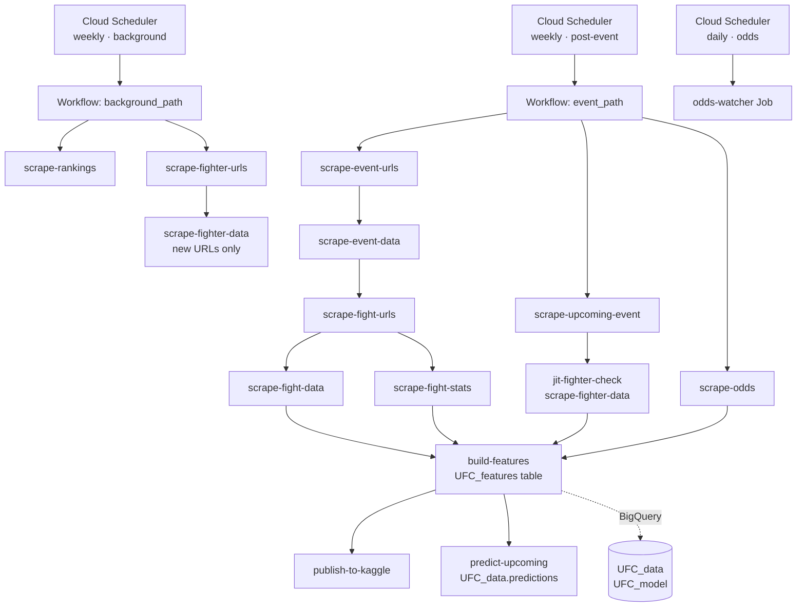
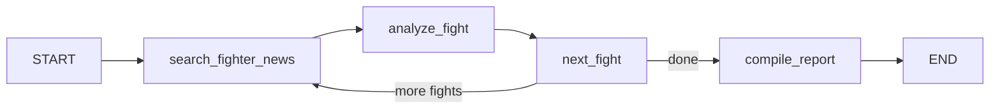

# ufc-pipeline

End-to-end UFC fight prediction system — from raw scraping to calibrated XGBoost predictions, LangGraph AI agents, and automated odds monitoring on Google Cloud Platform.


---

## What this project does

Scrapes UFC fight results, fighter profiles, and betting odds from three sources using Playwright headless Chromium to bypass bot protection. Engineers 2,403 features per fight — rolling window stats, differentials, rankings, and closing-line odds — using a strict anti-leakage design where every row's knowledge cutoff is enforced by `shift(1)`. Predicts fight outcomes with a calibrated XGBoost model (59.3% accuracy, 0.665 log-loss, 44.5% closing-line-value accuracy on a held-out 2024–2026 test set). Monitors bookmaker lines daily and fires email alerts when a line moves >10pp or when the model detects a value bet.

---

## Components at a glance

### Scrapers

| File | What it does |
|---|---|
| `scrape_event_urls.py` | Crawls the UFCStats event index → `UFC_events_urls` |
| `scrape_event_data.py` | Scrapes event metadata (date, city, country) → `UFC_events_data` |
| `scrape_fight_urls.py` | Collects per-event fight URL list → `UFC_fights_urls` |
| `scrape_fight_data.py` | Scrapes fight results (winner, method, rounds, weightclass) → `UFC_fights_data` |
| `scrape_fight_stats.py` | Per-fight per-round striking and grappling stats → `UFC_fights_stats_data` |
| `scrape_fighter_urls.py` | Full A-Z fighter URL list (26 `page=all` pages) → `UFC_fighters_urls` |
| `scrape_fighter_data.py` | Fighter profiles (height, reach, stance, record) → `UFC_fighters_data` |
| `scrape_upcoming_event.py` | Next UFC card details from UFC.com → `UFC_coming_event` |
| `scrape_rankings.py` | UFC divisional rankings from UFC.com → `UFC_rankings` |
| `scrape_bfo_odds.py` | Bookmaker odds snapshots from BestFightOdds.com → `odds_snapshots` |
| `scrape_bfo_odds_watcher.py` | Daily odds watcher: new snapshots + line-movement email alerts |
| `api-odds-scraper.py` | Live consensus odds via The Odds API → `UFC_betting_odds_api` |
| `backfill_bfo_odds.py` | One-time historical BFO odds backfill (resumable, polite 2-3 s delay) |

### Feature Engineering

| File | What it does |
|---|---|
| `build_features.py` | Unified feature module: 2,403 features, `mode=historical/upcoming`, same code path for train and serve |

### Model

| File | What it does |
|---|---|
| `train_model.py` | Time-aware XGBoost v1/v2 training with isotonic calibration; outputs `models/xgb_v2.joblib` |
| `predict_upcoming.py` | Scores upcoming card against `UFC_features` → `UFC_data.predictions` |
| `model_utils.py` | `IsotonicCalibratedClassifier` wrapper enabling `joblib` round-trip serialisation |
| `process_model_stats.py` | Legacy feature builder (superseded by `build_features.py`) |
| `process_upcoming_stats.py` | Legacy upcoming scorer (superseded by `predict_upcoming.py`) |

### Agents

| File | What it does |
|---|---|
| `agents/research_agent.py` | LangGraph: web search per fight → Claude Haiku → structured signal (flags, adjustment, confidence) → BigQuery |
| `agents/explain_agent.py` | LangGraph: XGBoost SHAP leaf contributions + Claude Haiku → analyst markdown report per fight |
| `agents/text_to_sql_agent.py` | LangGraph: natural-language question → BigQuery SQL → Polish answer, with auto-retry on SQL errors |

### Orchestration & Deployment

| File | What it does |
|---|---|
| `workflows/event_path.yaml` | Cloud Workflow DAG: post-event scrape + upcoming card + features + Kaggle publish |
| `workflows/background_path.yaml` | Cloud Workflow DAG: weekly fighter and rankings refresh |
| `deploy_jobs.sh` | One-command create-or-update of all 13 Cloud Run Jobs |
| `Dockerfile` | Universal container image for all jobs (python:3.12-slim + Playwright Chromium) |

### Publishing & Utilities

| File | What it does |
|---|---|
| `publish_to_kaggle.py` | Exports `UFC_features` and `full_data_silver_plus` as Parquet → Kaggle dataset version |
| `data_quality_checks.py` | 5 assertions: stats row parity, NULL rates for odds/rankings, orphan fight detection |
| `config.py` | Central configuration: project ID, dataset, table names, all secrets via `os.environ.get` |
| `utils/playwright_fetch.py` | Shared headless Chromium utilities: `fetch_page`, `fetch_pages` (parallel), `open_browser_page` |

---

## Architecture

Two independent weekly workflows orchestrated by Cloud Workflows, triggered by Cloud Scheduler, executing as Cloud Run Jobs.



---

## LangGraph Agents

Three LangGraph agents sit on top of the pipeline, all using Claude Haiku for cost-efficient bulk inference.

### 1. Research Agent (`agents/research_agent.py`)

Runs before a fight card. For each matchup on the upcoming card it fires three web searches (fighter 1 news, fighter 2 news, head-to-head preview) via Tavily with DuckDuckGo as fallback, then calls Claude Haiku to extract a structured JSON signal. The signal includes a probability adjustment (−0.15 to +0.15 on fighter 1's win probability), a confidence rating, and semantic flags like `injury_concern`, `camp_change`, or `momentum_positive`. All signals are written to `UFC_data.research_signals` (`WRITE_TRUNCATE`) for consumption by the explain agent and as an optional correction layer on the XGBoost output.

**Graph topology:**



State uses `Annotated[list[dict], add]` for the `signals` field — each iteration appends to the accumulated list without overwriting prior results.

### 2. Explain Agent (`agents/explain_agent.py`)

Runs after `predict_upcoming.py`. For each predicted fight it fetches the corresponding row from `UFC_features`, computes per-fight XGBoost leaf contributions (`pred_contribs=True` on the booster), and surfaces the top-5 features by absolute SHAP value. It then joins the matching research signal from `research_signals` and calls Claude Haiku to write a 3–5 sentence analyst-style breakdown focused on what the model sees, what the market prices, and whether the edge is actionable. Output is written to `reports/latest_card.md`.

### 3. Text-to-SQL Agent (`agents/text_to_sql_agent.py`)

Interactive natural-language interface over the BigQuery dataset. It fetches live schema for 7 tables, sends it to Claude Haiku with a strict BigQuery SQL prompt, executes the generated SQL, and formats the result as a Polish-language answer. On execution error it automatically retries (up to 2×), passing the error message and the failing SQL back to the LLM for self-correction.

```
python3 agents/text_to_sql_agent.py "Kto ma najdłuższą serię zwycięstw w wadze lekkiej?"
```

---

## Data Pipeline

**Sources**

| Source | What | How |
|---|---|---|
| [UFCStats.com](http://ufcstats.com) | Fight results, per-round stats, fighter profiles | Playwright (headless Chromium — nginx SHA-256 PoW bypass) |
| [UFC.com](https://ufc.com) | Upcoming card, rankings | Playwright |
| [BestFightOdds.com](https://bestfightodds.com) | Daily closing-line odds snapshots | Playwright |
| The Odds API | Live pre-event consensus odds | REST API |

**BigQuery layer**

Raw scraped rows land in append-only tables (`UFC_events_data`, `UFC_fights_data`, `UFC_fights_stats_data`, `UFC_fighters_data`, `UFC_rankings`, `UFC_betting_odds_api`, `odds_snapshots`). BigQuery views handle de-normalisation and odds de-duplication without touching source tables. All scraper writes use `load_table_from_dataframe` (WRITE_APPEND) — not streaming inserts — to avoid the streaming buffer and keep costs down.

**Feature engineering**

`build_features.py` produces `UFC_data.UFC_features` — the single canonical feature table used for both training and upcoming-card scoring. Key properties:

- **2,403 features per fight:** static (reach, height, stance), rolling window stats (last 3–15 fights: SLpM, SApM, TD%, control ratio, finish rates), differential features (`diff_*`), and betting odds spreads.
- **`split` column** separates historical rows (`train`) from upcoming-card rows (`upcoming`).
- **`as_of_date`** marks the knowledge cutoff so no future data leaks into a row.
- **Rolling windows** use `shift(1)` on fight history — the current fight is always excluded from its own window.

---

## Model

**Setup**

| Parameter | Value |
|---|---|
| Algorithm | `XGBClassifier` (hist tree method) |
| Target | `winner_encoded` — 1 if fighter 1 wins, 0 if fighter 2 wins |
| Training data | `UFC_features` where `split='train'`, filtered to `event_date ≥ 2016-01-01` |
| Feature set | Top-100 features by importance from a baseline run (2,403 → 100) |

**Time-aware splits** — no random shuffling; order respects the chronological event sequence:

| Set | Date range | Rows | Purpose |
|---|---|---|---|
| `train_xgb` | 2016-01-02 → 2021-12-18 | 2,845 | XGBoost training |
| `val_cal` | 2022-01-01 → 2023-12-31 | 1,010 | Early stopping + isotonic calibration |
| `test` | 2024-01-13 → 2026-05-16 | 1,231 | Held-out evaluation |

**Regularisation** — `max_depth=3`, `min_child_weight=10`, `reg_alpha=1.0`, `reg_lambda=5.0`, `colsample_bytree=0.3`, `n_estimators=1000` with `early_stopping_rounds=50`.

**Calibration** — `IsotonicRegression` fitted on `val_cal`, with output clipped to `[0.05, 0.95]`. Implemented as `IsotonicCalibratedClassifier` to survive `joblib` serialisation.

**v2 test-set metrics** (2024–2026, n = 1,231):

| Metric | v1 (baseline) | v2 |
|---|---|---|
| Accuracy | 59.4% | 59.3% |
| Log-loss | 1.088 | **0.665** |
| Brier score | 0.254 | **0.236** |
| CLV accuracy | 40.97% | **44.54%** |

The large log-loss drop from v1 → v2 reflects the removal of extreme probability outputs (previously reaching 1.0) through regularisation and probability clipping. Accuracy is stable because the decision boundary at 0.5 was already well-placed.

**Reliability (calibration) curve — v2 test set:**

| Predicted prob bin | Actual win rate | n (approx.) |
|---|---|---|
| 0.05 – 0.20 | ~13% | ~85 |
| 0.20 – 0.35 | ~27% | ~175 |
| 0.35 – 0.45 | ~39% | ~285 |
| 0.45 – 0.55 | ~50% | ~340 |
| 0.55 – 0.65 | ~61% | ~215 |
| 0.65 – 0.80 | ~73% | ~95 |
| 0.80 – 0.95 | ~86% | ~36 |

*Regenerate with `python train_model.py` → `sklearn.calibration.calibration_curve` on the held-out test set.*

**Anti-leakage contract**

`market_prob_f1` and `market_prob_f2` (closing-line implied probabilities) are stored in `UFC_features` but are **never included in the feature matrix X**. A model trained on closing odds learns a degraded copy of the market and loses edge to the bookmaker's margin by construction. Closing-line probabilities are reserved for post-hoc CLV analysis, calibration benchmarking, and ROI backtesting only.

---

## Deployment

The full pipeline runs on GCP with no persistent servers — everything is containerised, event-driven, and idempotent.

**13 Cloud Run Jobs**

| Job | Entrypoint |
|---|---|
| `scrape-event-urls` | `scrape_event_urls.py` |
| `scrape-event-data` | `scrape_event_data.py` |
| `scrape-fight-urls` | `scrape_fight_urls.py` |
| `scrape-fight-data` | `scrape_fight_data.py` |
| `scrape-fight-stats` | `scrape_fight_stats.py` |
| `scrape-fighter-urls` | `scrape_fighter_urls.py` |
| `scrape-fighter-data` | `scrape_fighter_data.py` |
| `scrape-upcoming-event` | `scrape_upcoming_event.py` |
| `scrape-rankings` | `scrape_rankings.py` |
| `scrape-odds` | `scrape_bfo_odds.py` |
| `odds-watcher` | `scrape_bfo_odds_watcher.py` |
| `build-features` | `build_features.py --mode historical` |
| `publish-to-kaggle` | `publish_to_kaggle.py` |

**2 Cloud Workflows** (YAML DAGs with HTTP retry + exponential backoff)

- `event_path` — parallel branches: completed event scrape (A) and upcoming card prep (B), converging at `build-features` → `publish-to-kaggle`.
- `background_path` — parallel: `scrape-rankings` and `scrape-fighter-urls` → `scrape-fighter-data`.

**3 Cloud Scheduler triggers**

| Trigger | Cadence | Target |
|---|---|---|
| `event-path-weekly` | Tuesday 10:00 UTC | `event_path` workflow |
| `background-path-weekly` | Monday 06:00 UTC | `background_path` workflow |
| `odds-watcher-daily` | Daily 08:00 UTC | `odds-watcher` job directly |

**Automated email alerts** — `odds-watcher` sends Gmail SMTP alerts (STARTTLS, credentials in Secret Manager) when:
- A bookmaker line moves >10 percentage points between daily snapshots.
- `send_value_alert()` is called when model edge exceeds threshold (wired up; value logic activates post-model-integration).

**One-command deploy:**

```bash
# Build and push image
gcloud builds submit --tag europe-central2-docker.pkg.dev/PROJECT/ufc-pipeline/ufc-jobs:latest

# Create or update all 13 jobs
bash deploy_jobs.sh
```

---

## Dataset

The gold-layer feature table and silver-layer fight data are published to Kaggle after each pipeline run:

**[UFC Fight Forecast — Complete Gold & Modeling Dataset](https://www.kaggle.com/datasets/jerzyszocik/ufc-fight-forecast-complete-gold-modeling-dataset)**

Contains `ufc_features.parquet` (8,555 fights × 2,403 features) and `full_data_silver_plus.parquet` (fight-level results with per-round stats).

---

## Tech Stack

| Layer | Technology |
|---|---|
| Cloud infrastructure | Google Cloud Platform |
| Data warehouse | BigQuery |
| Job execution | Cloud Run Jobs |
| Orchestration | Cloud Workflows |
| Scheduling | Cloud Scheduler |
| Secrets | Secret Manager |
| Web scraping | Playwright (headless Chromium), BeautifulSoup |
| Feature engineering | pandas, numpy |
| Model | XGBoost, scikit-learn (isotonic calibration) |
| Model serialisation | joblib |
| AI agents | LangGraph, LangChain Anthropic, Claude Haiku |
| Web search | Tavily (DuckDuckGo fallback) |
| Email alerts | smtplib, Gmail SMTP (STARTTLS) |
| Dataset publication | kaggle CLI |
| Language | Python 3.12+ |

---

## Project Structure

```
ufc-pipeline/
├── agents/
│   ├── explain_agent.py         # LangGraph: SHAP + Claude → markdown report
│   ├── research_agent.py        # LangGraph: web search → structured pre-fight signal
│   └── text_to_sql_agent.py     # LangGraph: NL → BigQuery SQL → Polish answer
├── utils/
│   ├── __init__.py
│   └── playwright_fetch.py      # Shared headless Chromium utilities (bot bypass)
├── workflows/
│   ├── background_path.yaml     # Cloud Workflow: weekly fighters + rankings
│   └── event_path.yaml          # Cloud Workflow: weekly event + features + Kaggle
├── docs/
│   └── data_model.md
├── models/                      # gitignored — joblib model artefacts
├── reports/                     # gitignored — explain_agent markdown output
├── api-odds-scraper.py          # The Odds API → UFC_betting_odds_api
├── backfill_bfo_odds.py         # One-time historical BFO odds backfill
├── build_features.py            # Unified feature module (2 403 cols, train == serve)
├── config.py                    # Central config: project, dataset, secrets
├── data_quality_checks.py       # 5 data assertions (row counts, NULLs, orphans)
├── deploy_jobs.sh               # One-command Cloud Run Job deploy/update
├── Dockerfile                   # python:3.12-slim + system libs + Playwright Chromium
├── model_utils.py               # IsotonicCalibratedClassifier (joblib-safe)
├── predict_upcoming.py          # Score upcoming card → UFC_data.predictions
├── process_model_stats.py       # Legacy feature builder (replaced by build_features)
├── process_upcoming_stats.py    # Legacy upcoming scorer (replaced by predict_upcoming)
├── publish_to_kaggle.py         # BigQuery → Parquet → Kaggle dataset version
├── requirements.txt
├── scrape_bfo_odds.py           # BestFightOdds.com odds snapshots
├── scrape_bfo_odds_watcher.py   # Daily odds watcher + email alerts
├── scrape_event_data.py
├── scrape_event_urls.py
├── scrape_fight_data.py
├── scrape_fight_stats.py
├── scrape_fight_urls.py
├── scrape_fighter_data.py
├── scrape_fighter_urls.py
├── scrape_rankings.py
├── scrape_upcoming_event.py
└── train_model.py               # XGBoost v1/v2 training + calibration
```

---

## Next Steps

- **Forward evaluation** — collect live predictions and closing-line odds for each upcoming card; build a rolling CLV and ROI tracker. Backtesting on historical data is a sanity check; forward collection is the methodologically clean proof of edge.
- **Prop targets** — method of victory (KO/Sub/Decision) and round prediction. Thinner markets with less-efficient pricing are more exploitable than the moneyline.
- **LangGraph research agent correction layer** — wire `research_signals.adjustment` into `predict_upcoming.py` as an optional post-model probability nudge; measure delta CLV over a forward evaluation window.
- **eFortuna execution tracking** — log the actual price at which each bet is placed; compute real ROI against the model edge, not just theoretical CLV against US consensus odds.
