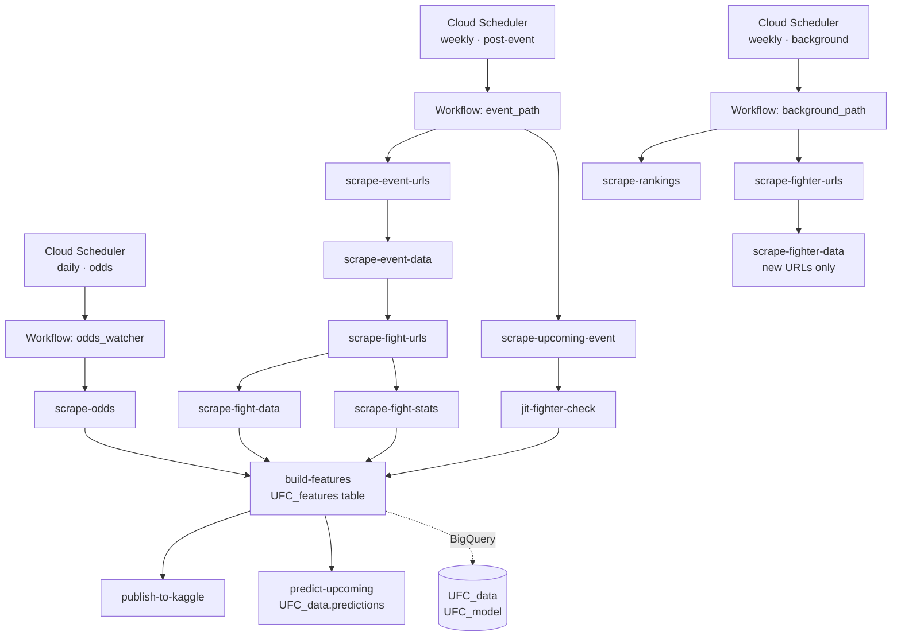

# ufc-pipeline

End-to-end UFC fight prediction pipeline on Google Cloud Platform — from raw scraping through feature engineering to calibrated probability predictions and Kaggle publication.

---

## Architecture

Two independent weekly workflows orchestrated by Cloud Workflows, triggered by Cloud Scheduler, executing as Cloud Run Jobs.

---

## Data Pipeline

**Sources**

| Source | What | How |
|---|---|---|
| [UFCStats.com](http://ufcstats.com) | Fight results, per-round stats, fighter profiles | `requests` + `BeautifulSoup` |
| [UFC.com](https://ufc.com) | Upcoming card, rankings | `requests` + `BeautifulSoup` |
| [BestFightOdds.com](https://bestfightodds.com) | Daily closing-line odds snapshots | `Playwright` (headless Chromium) |
| The Odds API | Live pre-event consensus odds | REST API |

**BigQuery layer**

Raw scraped rows land in append-only tables (`UFC_events_data`, `UFC_fights_data`, `UFC_fights_stats_data`, `UFC_fighters_data`, `UFC_rankings`, `UFC_betting_odds_api`, `UFC_odds_snapshots`). A set of BigQuery views handles denormalisation and odds de-duplication without touching source tables.

**Feature engineering**

`build_features.py` produces `UFC_data.UFC_features` — the single canonical feature table used for both training and upcoming-card scoring. Key properties:

- 2 403 features per fight: static (reach, height, stance), rolling window stats (last 3–15 fights: SLpM, SApM, TD%, control ratio, finish rates), differential features (`diff_*`), and betting odds spreads.
- `split` column separates historical rows (`train`) from upcoming-card rows (`upcoming`).
- `as_of_date` marks the knowledge cutoff so no future data leaks into a row.
- Rolling windows use a `shift(1)` on fight history — the current fight is always excluded.

---

## Model

**Setup**

| Parameter | Value |
|---|---|
| Algorithm | `XGBClassifier` (hist tree method) |
| Target | `winner_encoded` — 1 if fighter 1 wins, 0 if fighter 2 wins |
| Training data | `UFC_features` where `split='train'`, filtered to `event_date ≥ 2016-01-01` |
| Feature set | Top-100 features by importance from a baseline run (2 403 → 100) |

**Time-aware split** — no random shuffling; splits respect the chronological order of events:

| Set | Date range | Rows | Purpose |
|---|---|---|---|
| `train_xgb` | 2016-01-02 → 2021-12-18 | 2 845 | XGBoost training |
| `val_cal` | 2022-01-01 → 2023-12-31 | 1 010 | Early stopping + isotonic calibration |
| `test` | 2024-01-13 → 2026-05-16 | 1 231 | Held-out evaluation |

**Regularisation** — `max_depth=3`, `min_child_weight=10`, `reg_alpha=1.0`, `reg_lambda=5.0`, `colsample_bytree=0.3`, `n_estimators=1000` with `early_stopping_rounds=50`.

**Calibration** — `IsotonicRegression` fitted on `val_cal` (equivalent to `CalibratedClassifierCV(cv='prefit', method='isotonic')`), with output clipped to `[0.05, 0.95]`.

**v2 test-set metrics** (2024–2026, n = 1 231):

| Metric | v1 (baseline) | v2 |
|---|---|---|
| Accuracy | 59.4% | 59.3% |
| Log-loss | 1.088 | **0.665** |
| Brier score | 0.254 | **0.236** |
| CLV accuracy | 40.97% | **44.54%** |

The large log-loss drop from v1 → v2 reflects the removal of extreme probability outputs (previously reaching 1.0) through regularisation and probability clipping. Accuracy is stable because the decision boundary at 0.5 was already in the right place.

---

## Anti-Leakage Contract

`market_prob_f1` and `market_prob_f2` (closing-line implied probabilities) are stored in `UFC_features` but are **never included in the feature matrix X**. A model trained on closing odds learns a degraded copy of the market and loses edge to the bookmaker's margin by construction. Closing-line probabilities are used only for post-hoc CLV analysis, calibration benchmarking, and ROI backtesting.

---

## Tech Stack

| Layer | Technology |
|---|---|
| Cloud infrastructure | Google Cloud Platform |
| Data warehouse | BigQuery |
| Job execution | Cloud Run Jobs |
| Orchestration | Cloud Workflows |
| Scheduling | Cloud Scheduler |
| Secrets | Secret Manager |
| Web scraping | `requests`, `BeautifulSoup`, `Playwright` |
| Feature engineering | `pandas`, `numpy` |
| Model | `xgboost`, `scikit-learn` |
| Model serialisation | `joblib` |
| Dataset publication | `kaggle` CLI |
| Language | Python 3.12+ |

---

## Dataset

The gold-layer feature table and silver-layer fight data are published to Kaggle after each pipeline run:

**[UFC Fight Forecast — Complete Gold & Modeling Dataset](https://www.kaggle.com/datasets/jerzyszocik/ufc-fight-forecast-complete-gold-modeling-dataset)**

Contains `ufc_features.parquet` (8 555 fights × 2 403 features) and `full_data_silver_plus.parquet` (fight-level results with per-round stats).

---

## Next Steps

- **LangGraph research agent** — structured pre-fight signal per matchup (injury reports, camp changes, stylistic notes) feeding into a correction layer on top of the XGBoost probability. Measured by delta CLV.
- **Prop targets** — method of victory (KO/Sub/Decision) and round prediction. Thinner markets with less-efficient pricing are more exploitable than the moneyline.
- **Forward evaluation** — collect live predictions and closing-line odds for each upcoming card, build a rolling CLV and ROI tracker. Backtesting on historical data is a sanity check; forward collection is the methodologically clean proof of edge.
