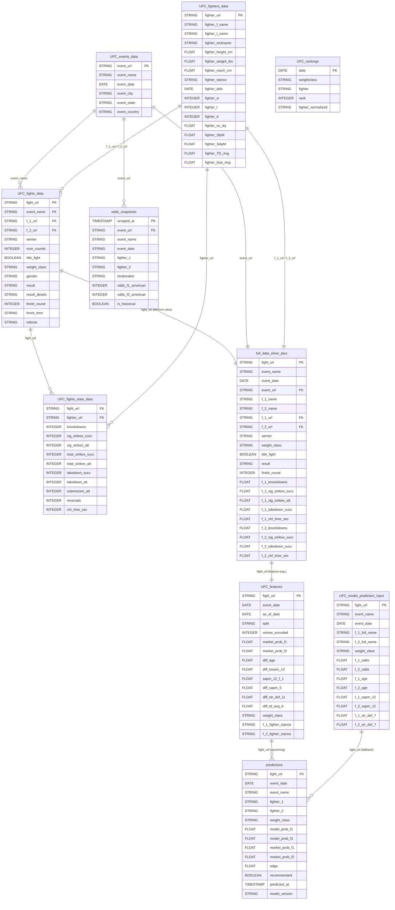

# Data Model

```mermaid
erDiagram
    %% ─── RAW / BRONZE TABLES ───────────────────────────────────────────────────

    UFC_events_data {
        STRING  event_url   PK
        STRING  event_name
        DATE    event_date
        STRING  event_city
        STRING  event_state
        STRING  event_country
    }

    UFC_fights_data {
        STRING  fight_url   PK
        STRING  event_name  FK
        STRING  f_1_url     FK
        STRING  f_2_url     FK
        STRING  winner
        INTEGER num_rounds
        BOOLEAN title_fight
        STRING  weight_class
        STRING  gender
        STRING  result
        STRING  result_details
        INTEGER finish_round
        STRING  finish_time
        STRING  referee
    }

    UFC_fighters_data {
        STRING  fighter_url  PK
        STRING  fighter_f_name
        STRING  fighter_l_name
        STRING  fighter_nickname
        FLOAT   fighter_height_cm
        FLOAT   fighter_weight_lbs
        FLOAT   fighter_reach_cm
        STRING  fighter_stance
        DATE    fighter_dob
        INTEGER fighter_w
        INTEGER fighter_l
        INTEGER fighter_d
        FLOAT   fighter_nc_dq
        FLOAT   fighter_SlpM
        FLOAT   fighter_SApM
        FLOAT   fighter_TD_Avg
        FLOAT   fighter_Sub_Avg
    }

    UFC_fights_stats_data {
        STRING  fight_url   FK
        STRING  fighter_url FK
        INTEGER knockdowns
        INTEGER sig_strikes_succ
        INTEGER sig_strikes_att
        INTEGER total_strikes_succ
        INTEGER total_strikes_att
        INTEGER takedown_succ
        INTEGER takedown_att
        INTEGER submission_att
        INTEGER reversals
        INTEGER ctrl_time_sec
    }

    UFC_rankings {
        DATE    date          PK
        STRING  weightclass
        STRING  fighter
        INTEGER rank
        STRING  fighter_normalized
    }

    odds_snapshots {
        TIMESTAMP scraped_at    PK
        STRING    event_url     FK
        STRING    event_name
        STRING    event_date
        STRING    fighter_1
        STRING    fighter_2
        STRING    bookmaker
        INTEGER   odds_f1_american
        INTEGER   odds_f2_american
        BOOLEAN   is_historical
    }

    %% ─── SILVER LAYER ───────────────────────────────────────────────────────────

    full_data_silver_plus {
        STRING  fight_url       PK
        STRING  event_name
        DATE    event_date
        STRING  event_url       FK
        STRING  f_1_name
        STRING  f_2_name
        STRING  f_1_url         FK
        STRING  f_2_url         FK
        STRING  winner
        STRING  weight_class
        BOOLEAN title_fight
        STRING  result
        INTEGER finish_round
        FLOAT   f_1_knockdowns
        FLOAT   f_1_sig_strikes_succ
        FLOAT   f_1_sig_strikes_att
        FLOAT   f_1_takedown_succ
        FLOAT   f_1_ctrl_time_sec
        FLOAT   f_2_knockdowns
        FLOAT   f_2_sig_strikes_succ
        FLOAT   f_2_takedown_succ
        FLOAT   f_2_ctrl_time_sec
    }

    %% ─── GOLD LAYER — FEATURE TABLE ────────────────────────────────────────────

    UFC_features {
        STRING  fight_url       PK
        DATE    event_date
        DATE    as_of_date
        STRING  split
        INTEGER winner_encoded
        FLOAT   market_prob_f1
        FLOAT   market_prob_f2
        FLOAT   diff_age
        FLOAT   diff_losses_12
        FLOAT   sapm_12_f_1
        FLOAT   diff_sapm_5
        FLOAT   diff_str_def_11
        FLOAT   diff_td_avg_6
        STRING  weight_class
        STRING  f_1_fighter_stance
        STRING  f_2_fighter_stance
    }

    %% ─── PREDICTION OUTPUT ──────────────────────────────────────────────────────

    predictions {
        STRING    fight_url       FK
        DATE      event_date
        STRING    event_name
        STRING    fighter_1
        STRING    fighter_2
        STRING    weight_class
        FLOAT     model_prob_f1
        FLOAT     model_prob_f2
        FLOAT     market_prob_f1
        FLOAT     market_prob_f2
        FLOAT     edge
        BOOLEAN   recommended
        TIMESTAMP predicted_at
        STRING    model_version
    }

    %% ─── STAGING / HELPER VIEWS ────────────────────────────────────────────────

    UFC_model_prediction_input {
        STRING  fight_url   PK
        STRING  event_name
        DATE    event_date
        STRING  f_1_full_name
        STRING  f_2_full_name
        STRING  weight_class
        FLOAT   f_1_odds
        FLOAT   f_2_odds
        FLOAT   f_1_age
        FLOAT   f_2_age
        FLOAT   f_1_sapm_12
        FLOAT   f_2_sapm_12
        FLOAT   f_1_str_def_7
        FLOAT   f_2_str_def_7
    }

    %% ─── RELATIONSHIPS ──────────────────────────────────────────────────────────

    UFC_events_data       ||--o{ UFC_fights_data          : "event_name"
    UFC_fighters_data     ||--o{ UFC_fights_data          : "f_1_url / f_2_url"
    UFC_fights_data       ||--o{ UFC_fights_stats_data    : "fight_url"
    UFC_fighters_data     ||--o{ UFC_fights_stats_data    : "fighter_url"
    UFC_events_data       ||--o{ odds_snapshots           : "event_url"

    UFC_fights_data       ||--|| full_data_silver_plus    : "fight_url (denorm view)"
    UFC_events_data       ||--|| full_data_silver_plus    : "event_url"
    UFC_fighters_data     ||--|| full_data_silver_plus    : "f_1_url / f_2_url"

    full_data_silver_plus ||--|| UFC_features             : "fight_url (feature eng.)"
    UFC_features          ||--o{ predictions              : "fight_url (upcoming)"
    UFC_model_prediction_input ||--o{ predictions         : "fight_url (fallback)"
```
